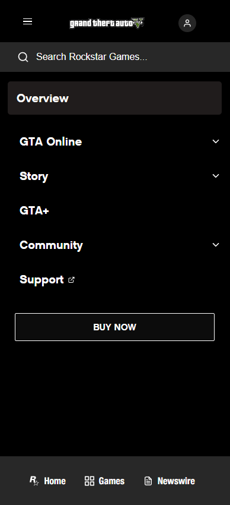

# Procesverslag
Markdown is een simpele manier om HTML te schrijven.  
Markdown cheat cheet: [Hulp bij het schrijven van Markdown](https://github.com/adam-p/markdown-here/wiki/Markdown-Cheatsheet).

Nb. De standaardstructuur en de spartaanse opmaak van de README.md zijn helemaal prima. Het gaat om de inhoud van je procesverslag. Besteedt de tijd voor pracht en praal aan je website.

Nb. Door *open* toe te voegen aan een *details* element kun je deze standaard open zetten. Fijn om dat steeds voor de relevante stuk(ken) te doen.

## Jij

  
uitwerken voor kick-off werkgroep

  ### Auteur:
  James Kok

  #### Je startniveau:
  Rood

  #### Je focus:
  Surface Plane
 

## Je website

  
uitwerken voor kick-off werkgroep

  ### Je opdracht:
  https://www.rockstargames.com/gta-v

  #### Screenshot(s) van de eerste pagina (small screen): 
  Home Pagina - Gta V  
  
  
  #### Screenshot(s) van de tweede pagina (small screen):
  Gta Online - Discover  
  
  
 

## Toegankelijkheidstest 1/2 (week 1)

  
uitwerken na test in 2e werkgroep

  ### Bevindingen
  #### Verschillende Beperkingen:
  ##### Zicht beperkingen 
  Ik heb tijdens de les 2 verschillende zicht beperkingen ervaren. de eerste was dat allebei mijn ogen voor de helft afgedekt waren. Naar mijn ervaring had ik niet ontzettend veel moeite om met deze beperking het web te gebruiken. Het was enigsinds vervelend dat ik een grote zwarte vlek in mn rechterooghoek had zitten maar verder niet storend. De tweede     
  beperking die ik ervaren heb was een cataract/staar. Hiermee werd je zicht erg wazig met allerlei stipjes. Deze beperking maakte het bedienen van het web veel ingewikkelder omdat je echt veel dichter op je scherm moest gaan zitten. Ik denk dat hoog contrast o.a. zou kunnen bijdragen aan het gebruikersvriendelijker maken van websites voor mensen met deze 
  beperking. Dit zorgt ervoor dat je sneller zou kunnen zien wat de belangrijke acties zijn zodat je niet de hele webpagina hoeft te onderzoeken terwijl je moeite hebt met scherp zien. 
  ##### Motorische Beperking (spasmes)
  Ook heb ik een Schok apparaat kunnen proberen om spasmes/parkinson te simuleren. Ik weet niet hoe accuraat dit apparaat was maar als het werkelijk zo is dan is het web bedienen in zo'n situatie vrijwel onmogelijk met je handen. De eerste stand van de schokband zorgde ervoor dat mijn hand enorm ging trillen waardoor ik niet accuraat op het toetsenbord kon     klikken, maar de tweede en tevens ook veel pijnlijkere stand, zorgde ervoor dat mijn hand/onderarm samentrok waardoor ik uberhaupt mijn laptop niet meer kon bedienen.
  
  #### Screenreader
  Verder heb ik nog een screenreader uitgeprobeerd. Aangezien ik een windows apparaat heb moet ik gebruik maken van de "Narrator". Ik heb geprobeerd verschillende sites te navigeren met de narrator, waarondere H&M en Nike. Dit ging echter helemaal niet goed. Dit komt ongetwijfeld deels omdat ik niet handig ben met een screenreader en niet zo goed weet hoe 
  hij werkt, maar ik denk ook deels omdat de windows (11) narrator niet zo goed functioneert. Ten slotte zou dit ook nog kunnen zijn omdat de website niet semantisch gecodeerd is. Ik hoorde best wel vaak gewoon een vage benaming voor een element, of juist een directe benaming zoals "Link" of "Button" zonder enige verdere informatie.  

## Breakdownschets (week 1)

  
  
  
uitwerken na afloop 3e werkgroep

  ### de hele pagina: 
  

  ### dynamisch deel (hamburger menu): 
  

  ### wellicht nog een dynamisch deel (account options): 
  

## Voortgang 1 (week 2)

  
uitwerken voor 1e voortgang

  ### Stand van zaken
  De HTML structuur maken ging goed, ook de breakdown schets ging goed. Ik vond het fijn en praktisch om de element inspector te kunnen gebruiken om de benodigde elementen te kunnen    downloaden. Ik vind het lastig om te bedenken hoe sommige dynamische elementen (na)gemaakt moeten worden

  ### Agenda voor meeting
  Iedereen vragen stellen over zijn site en feedback ontvangen

  Justin: -
  James: Of bepaalde elementen wel gemaakt moeten worden en zo ja hoe
  Esha: - 
  Rick: - 

  ### Verslag van meeting
  hier na afloop snel de uitkomsten van de meeting vastleggen

  - Moeilijkste dingen hoeven niet
  - Aantal tips gekregen voor wat wel moet
  - HTML zag er goed uit behalde de class names, onduidelijk waren die

## Voortgang 2 (week 3)

  
uitwerken voor 2e voortgang

  ### Stand van zaken
  Ik had een beetje moeite met uberhaupt verder gaan aan het vak omdat vormgeving zon groot vak is. Wat wel goed ging is het hamburger menu begrijpen aan de hand van de lesopdrachten, waardoor ik nu zelf een hamburger menu kan maken voor mijn eigen site. Ook de footer maken ging soepel

  ### Agenda voor meeting
  samen met je groepje opstellen

  -: -
  James: - Dropup menu in footer | en hoe is het hamburger menu icoontje gemaakt moet dat zoals voorbeeldsite? |zoekbalk in nav, is een div oke? | waar je echte linkjes van de voorbeeld site kan doen, doen? section in de nav oke? voor spacing 
  Mamush: Mag ik eigen kleding fotos gebruiken ipv die van de website? | Moet ik voor dit absolute positioning gebruiken? | Hoe krijg ik meer ruimte tussen [...] 
  -: - 

  ### Verslag van meeting
  hier na afloop snel de uitkomsten van de meeting vastleggen

  - first of type en end of type
  - 2 Ul's align items column + space around
- ...

## Toegankelijkheidstest 2/2 (week 4)

  
uitwerken na test in 9e werkgroep

  ### Bevindingen
  Lijst met je bevindingen die in de test naar voren kwamen (geef ook aan wat er verbeterd is):

## Voortgang 3 (week 4)

  
uitwerken voor 3e voortgang

  ### Stand van zaken
  Het hamburger menu gaat dusver heel goed, ik heb wel een beetje moeite met de finishing touches en de echte details maar misschien moet ik me daarbij neerleggen

  ### Agenda voor meeting
  samen met je groepje opstellen

  -: -
  James: - Vraag over flexbox exception, vraag over hoe in detail ik iets moet maken, en vraag over Z indices van het hamburgermenu  
  Justin: Uitgebreidde vraag over een grid op zijn website
  -: - 

  ### Verslag van meeting
  hier na afloop snel de uitkomsten van de meeting vastleggen

  - Z-Index niet gelukt, maar zo gelaten
  - Hamburger menu wel compleet uitwerken, adhv details element
  - flexbox exception niet echt te doen zonder extra container

## Eindgesprek (week 5)

  
uitwerken voor eindgesprek

  ### Je uitkomst - karakteristiek screenshots:
  

  ### Dit ging goed/Heb ik geleerd: 
  Ik vind het heel chill dat ik nu de basics van een hamburger menu snap

  

  Ook vind ik het fijn dat ik nu weet hoe ik een carousel kan maken

  

  
  ### Dit was lastig/Is niet gelukt:
  ik had graag nog iets meer tijd en moeite willen steken in de echte details van de website zodat het er nog realistischer uit zag.

  
  

## Bronnenlijst

  
continu bijhouden terwijl je werkt

  Nb. Wees specifiek ('css-tricks' als bron is bijv. niet specifiek genoeg). 
  Nb. ChatGpT en andere AI horen er ook bij.
  Nb. Vermeld de bronnen ook in je code.

  1. bron 1
  2. bron 2
  3. ...

